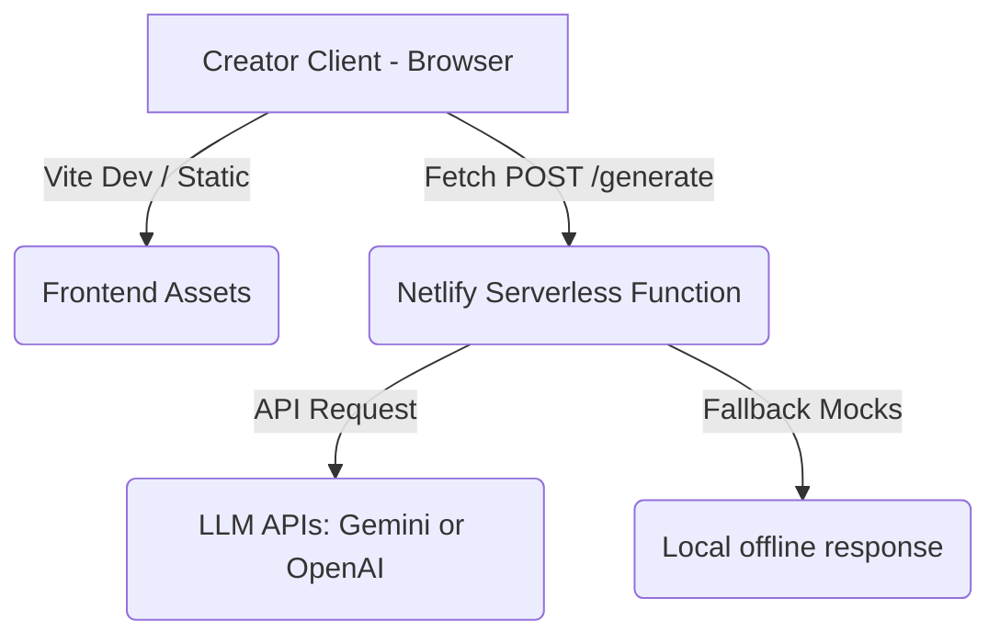
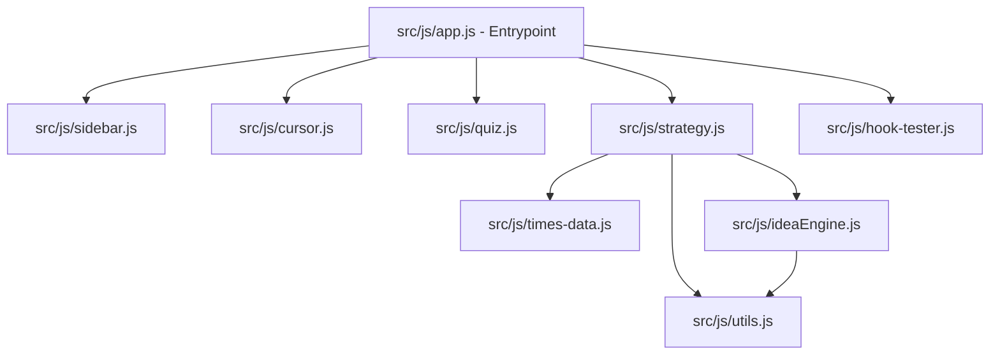
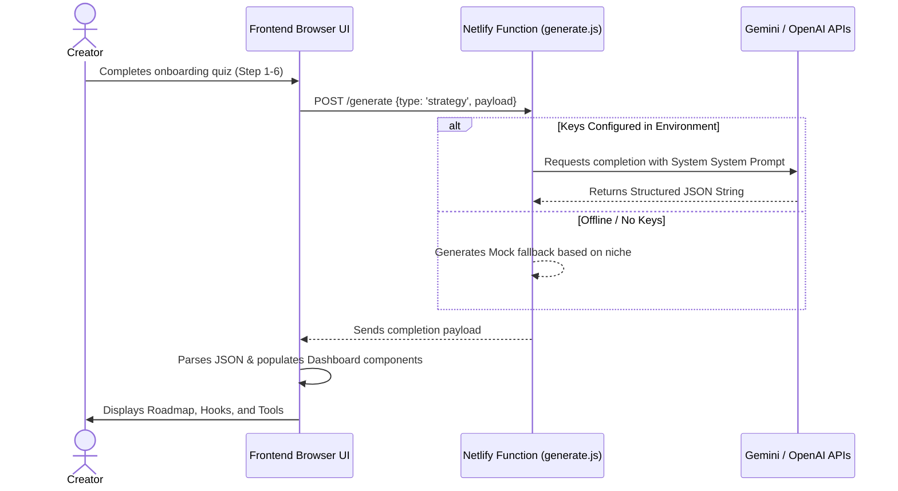

# System Architecture

This document describes the technical architecture of Contora, detailing its design patterns, module boundaries, data flows, and runtime environments.

---

## 1. System Overview

Contora is structured as a **Decoupled Jamstack Web Application** composed of a lightweight static frontend built with vanilla HTML/CSS/JS and a serverless backend hosted via Netlify Functions.

- **Frontend**: Serves responsive static assets (`index.html`, `styles.css`, and ES module scripts). Built without heavy frameworks for near-instant rendering and performance.
- **Backend (Netlify Functions)**: Serves as a secure API gateway proxy to LLM endpoints (OpenAI / Gemini), keeping API secrets hidden from client browsers.

---

## 2. Frontend Module Structure

The client application has been modernized from global scope scripts into structured **ES Modules** mapped below.

### Module Responsibilities
- **[app.js](file:///c:/Users/aryan/Contora/src/js/app.js)**: Imports all feature modules to compile the Vite dependency tree.
- **[sidebar.js](file:///c:/Users/aryan/Contora/src/js/sidebar.js)**: Manages dashboard panel expand/collapse states and saves user preferences to `localStorage`.
- **[cursor.js](file:///c:/Users/aryan/Contora/src/js/cursor.js)**: Runs requestAnimationFrame rendering of the custom mouse follower trail.
- **[quiz.js](file:///c:/Users/aryan/Contora/src/js/quiz.js)**: State machine managing the 6-question onboarding flow, input validations, transition animations, and page routing.
- **[strategy.js](file:///c:/Users/aryan/Contora/src/js/strategy.js)**: App controller. Orchestrates the netlify API requests, result dashboard construction, tab switching, and local email/clipboard saving.
- **[ideaEngine.js](file:///c:/Users/aryan/Contora/src/js/ideaEngine.js)**: Local combinational text-generation engine that outputs infinite niche-specific ideas without server requests.
- **[hook-tester.js](file:///c:/Users/aryan/Contora/src/js/hook-tester.js)**: Auditing tool that scores copy on immediate attention, pattern interrupt, curiosity gap, emotional triggers, and platforms fit.
- **[utils.js](file:///c:/Users/aryan/Contora/src/js/utils.js)**: Shared helpers for copying text and triggering feedback toasts.

---

## 3. Data Flow & Request Lifecycle

### Onboarding to Strategy Flow
1. **User Interaction**: The user selects options (Platform, Niche, Style, Skill, Time, Goal).
2. **Strategy Trigger**: Upon answering Step 6, `quiz.js` triggers its `_onQuizComplete` callback which invokes `genStrategy()` in `strategy.js`.
3. **API Request**: `genStrategy` issues a POST request to `/.netlify/functions/generate`.
4. **Backend LLM Negotiation**:
   - The serverless function parses the request and forwards the inputs to OpenAI or Gemini with structured system instructions.
   - The LLM responds with a JSON strategy payload.
5. **UI Rendering**: The JSON is parsed, and templates in `strategy.js` write dynamic cards (Roadmap list, Hook pills, CTA button) to the HTML.

---

## 4. Design Decisions & Best Practices

- **Isomorphic Window Exposes**: To support dynamic HTML templates that embed inline event handlers (like `onclick="copyText(...)"` and `onclick="switchTab(...)"`), key interface functions are explicitly assigned to the global `window` object at the bottom of each ES module. This guarantees backwards compatibility and robustness without heavy framework abstractions.
- **Vitest Setup Runner**: To allow fast and lightweight unit testing of browser-tied modules in a Node test runner, we use a setup script (`tests/setup.js`) to mock `window` and DOM selectors, keeping the production source files clean.
